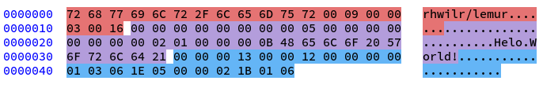

# Lemur

[](https://github.com/rhwilr/lemur/actions)
[](https://goreportcard.com/report/github.com/rhwilr/lemur)


This repository contains an interpreter and compiler for the **Lemur**
programming language. This is my implementation of the Monkey programming
language designed in [Write an Interpreter in Go][1] and [Writing A Compiler In
Go][2] by Thorsten Ball. Since finishing the book, I've made a lot of
improvements and changes to the language.

This language should not be used for anything serious. This is just a hoppy
project of mine, with the goal of learning Go while getting a deeper
understanding of how interpreters and compilers work.

[1]: https://interpreterbook.com/
[2]: https://compilerbook.com/

## Table of Contents

- [Lemur](#lemur)
  - [Table of Contents](#table-of-contents)
  - [Customizations](#customizations)
  - [Installation](#installation)
  - [Usage](#usage)
    - [Evaluator](#evaluator)
    - [Compiler](#compiler)
    - [VM](#vm)
  - [Syntax](#syntax)
  - [Data Types](#data-types)
    - [Definitions](#definitions)
    - [Arithmetic operations](#arithmetic-operations)
    - [Builtin functions](#builtin-functions)
    - [Conditionals](#conditionals)
    - [While-loops](#while-loops)
    - [Comments](#comments)
    - [Functions](#functions)
  - [Compiler Optimizations](#compiler-optimizations)
    - [Constants](#constants)
    - [Tail Recursion Optimization](#tail-recursion-optimization)
    - [Compiler Optimizations](#compiler-optimizations-1)
  - [Binary Format](#binary-format)
    - [Header](#header)
    - [Constant Pool](#constant-pool)
    - [Instructions](#instructions)
  - [Development](#development)


## Customizations

I made some changes in this implementation that differe from the implementation
in the book. Here are the changes I made.

- Added single-line & multi-line comments.
- Allow assignments without `let`.
- `let` can only be used to initialize a variable.
- More assignment operators such as `+=`, `-=`, `*=`, and `/=`.
- Added prefix and postfix operators (`++i`, `--i`, `i++`, `i--`).
- Allow accessing individual characters of a string via the index-operator.
- Allow string comparisons via `==`, `!=`, `<`, `>`, `<=`, and `>=`.
- Implemented `<=`, and `>=` comparisons for integers.
- Added support for logical operators `&&` and `||`. This also adds support for
  more complex conditionals like `if (i <= 10 && containsNumber(string))...`.
- Implemented `while` loops.
- Allow the definition of functions without a `let` or `const` statement.
- Function arguments may have default values.
- Defined my own binary format to save compiled code to file and read binary
  files in the vm.
- Added an optimization layer before the compiler to simplify the AST.


## Installation

To use the most recent version, clone the source repository and run the make
command to build the cli, compiler and vm:

```sh
git clone https://github.com/rhwilr/lemur.git
cd lemur
make
```

The latest binary can also be downloaded from
[Actions](https://github.com/rhwilr/lemur/actions) by clicking on the latest
build and downloading the artifacts.


## Usage

### Evaluator

To execute a script directly, use the `lemur` command line and pass the path to
the script.

```sh
lemur examples/helo-world.lem
```

### Compiler

The `lemur` executable can also be used to compile scripts with the `-c` flag.
However, there is also the `lemur-compiler` binary that does just that.

```sh
lemur-compiler examples/helo-world.lem
```

This will produce a binary file with the name `a.out` in the current folder. The
output file name can be changed with the `-o` parameter.

### VM

To execute the binary file, pass it to the `lemur-vm`:

```sh
lemur-vm a.out
```


## Syntax

**Note:** You can find some example programms in the [examples](examples/)
folder.


## Data Types

Lemur has support for the following data types:

| Type    | Syntax                                        | Commenta |
| ------- | --------------------------------------------- | -------- |
| Null    | `null`                                        |          |
| Boolen  | `true` `false`                                |          |
| Integer | `2` `4` `157954` `-9`                         |          |
| String  | `""` `"Helo World"`                           |          |
| Array   | `[]` `[3, 6, 9]` `["hi", 5]`                  |          |
| Hash    | `{}` `{"a": 5}` `{"name": "Mark", "age": 12}` |          |


### Definitions

We have support for constants and variables:

```js
const a = 3;
let number = 7;
```

Variables can be updated using asignments. Constants can not be updated.

```js
number = 8;

// prefix and postfix operators
// -- is also supported
number++;       // returns the current value, then increments number by 1
++number;       // increments number by 1, then returns the new value

number += 5;    // Adds 5 to the number
```


### Arithmetic operations

Lemur supports all the basic arithmetic operations of Integer types.

```js
let a = 4;
let b = 2;

println( a + b );  // Outputs: 6
println( a - b );  // Outputs: 2
println( a * b );  // Outputs: 8
println( a / b );  // Outputs: 2
```


### Builtin functions

These core primitives are part of the lemur language:

- `len`
  - Returns the length of an Array or String
- `first`
  - Returns the first element in an Array
- `last`
  - Returns the last element in an Array
- `rest`
  - Returns a new Array, containing every element of the passed Array, except
    the first element.
- `push`
  - Append an element to the end of an Array
- `read`
  - Reads a string from stdin
- `print`
  - Prints a String to stdout
- `println`
  - Prints a String to stdout, including a newline at the end.
- `env`
  - Returns a Hash with all environment variables. If a string is provided as an
    argument, it will only return the value if that environment variable.

### Conditionals

Lemur has support for `if` and `if else` expressions:

```js
let a = 4;

if (a > 10) {
  println("a is larger than 10");
} else {
  println("a is smaller or equal to 10");
}

```


### While-loops

Lemur has only support for one looping construct, the `while` loop:

```js
let i = 3;

while (i > 0) {
    println(i);
    i--;
}
// Outputs:
// 3
// 2
// 1
```
Lemur does not have a `break` or `continue` statement. However, `return` can be
used as one way of breaking out of a loop early inside a function.


### Comments

Comments were already used a few times in the examples. Lemur has support for
both single-line and multi-line comments.

```js
// Defining a variable
let number = 6;

/*
** The following line will print the number to the terminal.
** The two stars at the beginning of this line are not required,
** they are just there to make the text align.
*/
println(number);
```

### Functions

Functions are first class citizens in lemur. This means they can be passed as
arguments and returned by other functions like any other value.

```js
let fibonacci = function(x) {
  if (x == 0) { return 0; }
  if (x == 1) { return 1; }

  fibonacci(x - 1) + fibonacci(x - 2);
};

fibonacci(16);
// Outputs: 987
```

This example shows how to define functions, as well as that lemur has support
for recursive function calls. In addition to this, we also support closures, a
function inside another function that references a variable from the outer
scope:

```js
let first = 10;
let second = 10;

let ourFunction = function(first) {
  first + second;
};

ourFunction(20);
// Outputs: 30
```

A function always produces a value. `return` can be used to explicitally return
a value. If nothing is returned in the function, the result of the last
expression will be returned. This can also be `null` if the expression does not
produce a value.

Named functions can also be defined directly by specifing the identifier after
the `function` keyword. Additionally, arguments may have a default value, making
them optionl.

```js
function increment (x, inc = 1) {
  return x + inc;
}

increment(6); // Outputs: 7
increment(6, 2); // Outputs: 8
```


## Compiler Optimizations

Lemur implements the following optimizations in the compiler.

### Constants

Constant values are only added to the pool if the value is not already present.
This means, referencing the number `1` multiple times in the source code, for
example, will only produce one constant. This optimization is performed for
Integers and Strings.


### Tail Recursion Optimization

This is an optimization applied to recursive functions. Instead of pushing a new
frame onto the stack with each recursive call, the same function frame is
reused, efectifally flatining the recursion into a loop.

**Non tail recursive implementation:**
```js
const factorial = function(n) {
  if (n == 1) { return 1; }
  n * factorial(n - 1);
};
factorial(5);
```
```
factorial 6
6 * factorial 5
6 * 5 * factorial 4
6 * 5 * 4 * factorial 3
6 * 5 * 4 * 3 * factorial 2
6 * 5 * 4 * 3 * 2 * factorial 1
6 * 5 * 4 * 3 * 2 * 1
```

**Tail recursive implementation:**
```js
const factorial = function(n, a) {
  if (n == 0) { return a; }
  factorial(n - 1, a * n);
};
factorial(6, 1);
```
```
factorial 6 1
factorial 5 1
factorial 4 2
factorial 3 6
factorial 2 24
factorial 1 120
factorial 0 720
```


### Compiler Optimizations

Lemur applies some optimizations on the AST before it is parsed by the compiler.
The optimizer walks down the AST and is capable of performing simple
precalculations and simplifying boolean expressions.

Here are some examples of transformations the optimizer applies:

| Input                       | Output                 |
| --------------------------- | ---------------------- |
| `let i = (1 * 6) + 2;`      | `let i = 8;`           |
| `let i = 9 + 2 - 1;`        | `let i = 10;`          |
| `print("Helo " + "World");` | `print("Helo World");` |
| `while (0 < 99) {}`         | `while (true) {}`      |


## Binary Format

When compiling a programm, the compiler will write the output to a binary file.
To explain the binary format we compile the following simple programm:

```js
// example.lem
// Define a variable and mutiply it by 2
let number = 5;
number * 2;

// Then output a string to stdout.
println("Helo World!");
```

Compiling the programm with `lemur-compiler example.lem` will produce the
following binary file:



The file has 3 sections: `Header`, `Constant Pool`, and `Instructions`.

### Header

The header provides important information to the vm on how to interpret the
following bytes to correctly read the file.

| Bytes                                 | Description                                                                                                                |
| :------------------------------------ | :------------------------------------------------------------------------------------------------------------------------- |
| `72 68 77 69 6C 72 2F 6C 65 6D 75 72` | Signature. Used to identiy our binary format. The VM will only execute files with this signature.                          |
| `00 09 00`                            | Compiler version used to compile this files. Currently, the VM will denie execution if the version does not match exactly. |
| `00 03`                               | The number of constants in the constant pool.                                                                              |
| `00 16`                               | The length in bytes of the instructions section.                                                                           |


### Constant Pool

The constant pool contains all the primitive types contained in the sourcecode.
This includes `Integers`, `Strings`, and `Functions`. 

| Bytes                             | Description                                                                                                       |
| :-------------------------------- | :---------------------------------------------------------------------------------------------------------------- |
| `00` `00 00 00 00 00 00 00 05`    | The first byte (`00`) defines the type of the following constant, followed by the 8 byte uint64 for the number 5. |
| `00` `00 00 00 00 00 00 00 02`    | Same as before, this time for the number 2.                                                                       |
| `01` `00 00 00 0B` `48 ... 64 21` | Type for String, then the length (11), followed by the UTF-8 encoding of "Helo World!".                           |


| Byte | Type     | Parameters                                                                                              | Encoding              |
| :--- | :------- | :------------------------------------------------------------------------------------------------------ | :-------------------- |
| `00` | Integer  | -                                                                                                       | `uint64 BE`           |
| `01` | String   | Lenght(`uint32 BE`)                                                                                     | `UTF-8`               |
| `02` | Function | Instructions(`uint32 BE`), NumLocals(`uint32 BE`), NumParameters(`uint32 BE`), NumDefaults(`uint32 BE`) | Instructions bytecode |

`BE` = BigEndian


### Instructions

The last section contains the raw bytecode to execute the program. An
instruction is a 1 byte opcode, followed by a variable amount of operands. How
many operands there are defines the opcode.

Opcodes are defined in [code.go](code/code.go).

| Bytes        | Description                                                                                              |
| :----------- | :------------------------------------------------------------------------------------------------------- |
| `00` `00 00` | `OpConstant` loads a constant from the constant pool onto the stack. In this case it loads constant `0`. |
| `13` `00 00` | `OpSetGlobal` registers the current value on the stack as variable `0`.                                  |
| `12` `00 00` | `OpGetGlobal` loads the variable back on the stack.                                                      |
| `00` `00 01` | `OpConstant` loads constant `1` onto the stack. Constant `1` has the value 2.                            |
| `03`         | `OpMul` multiplies the top 2 values from the stack together and puts the value back onto the stack.      |
| ...          |                                                                                                          |


## Development

To set up the development environment for this repository you need `golang`
installed. A `Makefile` is configured to run the most common tasks:

| Command      | Description                |
| :----------- | :------------------------- |
| `make test`  | Runs all tests.            |
| `make build` | Compiles the Lemur binary. |
